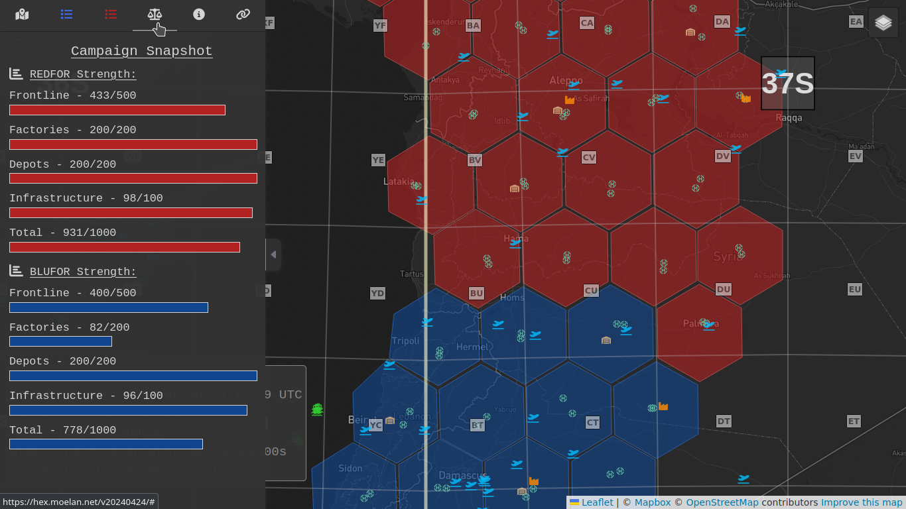
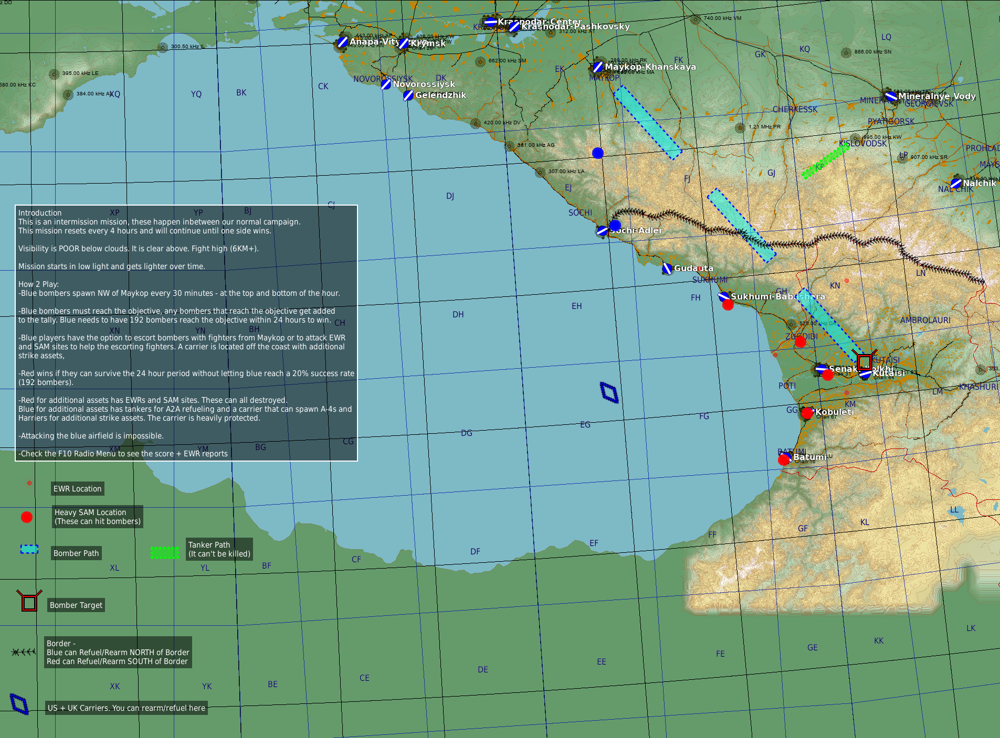
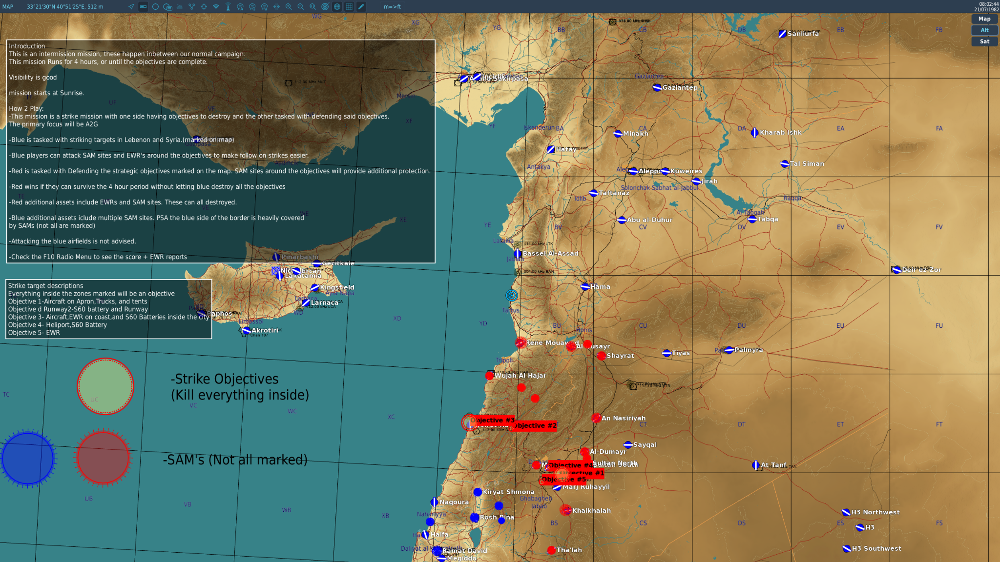

# ECW Community FAQ

This is an **unofficial** community-run FAQ for the Enigma's Cold War DCS server.

It is not the [Official FAQ](https://docs.google.com/presentation/d/1I-aD-s3zoEpV4gGu7QIrEdywkpklfT40te-mYlX3zk8)
but aims to include all the information from it and more.

## About this FAQ {: #about }

### What's wrong with the Official FAQ?

Nothing… except that because it's a Google Drive presentation, you can only link
to the whole thing, not to individual sections. Whereas here you can link to specific questions.

### How do I share a link to a specific question? {: #link-to-question }

Click on a heading and you should see a ¶ symbol appear next to it, which is a link to that question. Click on it and copy the address from your browser - or right-click/long-press and copy link.

For example the link to this question is <https://ecw-faq.readthedocs.io/en/latest/#link-to-question>

### Key Links {: #links }

| <!-- -->          | <!-- --> |
--------------------|-----------
Official FAQ        | [on Google Docs](https://docs.google.com/presentation/d/1I-aD-s3zoEpV4gGu7QIrEdywkpklfT40te-mYlX3zk8/)
ECW Discord         | <https://discord.com/invite/enigma89>
ECW Patreon         | <https://www.patreon.com/enigma89>
ECW YouTube channel | <https://youtube.com/@Enigma89>
Hexmap              | <https://hex.moelan.net/>
IFF guide           | [on Google Docs](https://docs.google.com/presentation/d/12hlVFNbwhzzPAnMnmT-uFSgLZDoziXorwtMNklJyON8/)
GitHub for this FAQ | <https://github.com/ecw-jack/ecw-faq>
Community A-4 mod   | <https://github.com/heclak/community-a4e-c>

## About the server {: #server }

### What is ECW?

ECW is Enigma's Dynamic Cold War Campaign. It is a PVP DCS server and community where Red and Blu players fight for control of the map, sector by sector. Player stats are tracked and can be seen in the Discord server. You can earn points for certain actions and spend them to summon AI support aircraft and unlock advanced aircraft for yourself.

The server uses the [Community A-4 mod](aircraft/a-4).

Watch the server trailer:

### What community mods does ECW support? {: #community-mods }

ECW uses [the A4 Mod](https://github.com/heclak/community-a4e-c) and **no other mods**.

Do not ask for other mods (Su-17, F-104 etc) to be added - if you do, you will get a time-out!

### What map/mission is currently running? {: #current-map }

Check the Hexmap: <https://hex.moelan.net>

### Connecting to ECW {: #connecting }

| <!-- -->        | <!-- -->                           |
|-----------------|------------------------------------|
| Server name     | Enigma's Dynamic Cold War Campaign |
| Server IP       | `176.9.116.10:10308`               |
| Server location | Falkenstein, Germany               |
| SRS IP          | `176.9.116.10:5002`                |
| SRS backup IP   | `76.253.187.61:5002`               |

### Server rules {: #rules }

From the offical FAQ:

> 1. _Do not be a jerk or malicious_
> 2. _Do not try to break the spirit of the server_
> 3. _No racism/sexism/xenophobia/etc_
> 4. _Do not step on SRS comms or be a nuisance on the radio_
> 5. _Do not re-slot to avoid death_
> 6. _Don't waste the time of the staff_
> 7. _Do not bomb airfield support structures to disable arming at enemy airfields_
> 
> _Anyone repeatedly violating these rules will be permanently banned._

### Mission Statement

> _To provide a fun, competitive and balanced (via parity) multiplayer dynamic campaign in DCS centered around the Cold War setting. Due to holes in the DCS playable aircraft universe, decisions must be made in order to achieve the mission statement. Main pillars are the fundamental truths and must be consulted and adhered to when changes are considered._

#### Pillar 1: Fun {: #pillar-fun }

> _The first and most important pillar is to ensure that the server remains accessible and fun for players to enjoy. Restrictive mechanics like lives, side locking and fuel refueling will never be part of the server. Mechanics that take away fun or frustrate users are avoided._

#### Pillar 2: Competitive Campaign {: #pillar-competitive-campaign }

> _The second pillar is to lean into and encourage a competitive environment. A dynamic campaign where one side eventually wins is the main focus of the campaign. To avoid an airquake scenario, players and mechanics encourage participation in the campaign. Players should feel that their efforts are part of a larger effort._

#### Pillar 3: Balance/Parity and Asymmetry {: #pillar-balance }

> _Balance/Parity will be achieved while still allowing for asymmetrical fights. The plane sets will be sourced from historical availability to allow for asymmetrical fights but tweaked to ensure that there is parity between sides. Most of this tweaking comes into the availability of what weapons are and are not restricted._
>
> _The priority is: Parity/Balance > Asymmetry > Historical Accuracy_

#### Pillar 4: Creative Freedom {: #pillar-freedom }

> _Creative freedom will be used extensively in order to ensure that balance is there but asymmetry is a must to keep fights interesting. Creative freedom will be used in order to keep things fun and competitive._

## Radios

### REDFOR radio frequencies

Preset | Purpose                         | Frequency MHz
-------|---------------------------------|--------------
1      | All Aircraft Common / Human GCI | 124.0
2      | Extra channel                   | 126.0
3      | Extra channel                   | 128.0
4      | DCS AWACS                       | 130.0
5      | Extra channel                   | 132.0
       | Helicopter Common               | 30.0 FM
       | MiG-15                          | 4.95
       | Airfield / traffic calls	 | Don't
       
### BLUFOR radio frequencies

Preset | Purpose                         | Frequency MHz
-------|---------------------------------|--------------
1      | All Aircraft Common / Human GCI | 251.0
2      | Extra channel                   | 253.0
3      | Extra channel                   | 255.0
4      | DCS AWACS                       | 257.0
5      | Extra channel                   | 259.0
       | Helicopter Common               | 30.0 FM
       | Airfield / traffic calls	 | Don't

### SRS

The server uses [SRS (DCS SimpleRadio Standalone)](http://dcssimpleradio.com/) for voice comms.

Thanks to the magic of SRS, you can't hear transmissions from the other side's aircraft. (This is how Red and Blu helos can both use 30.0 MHz FM.)

In practice, many players use Discord for comms, and many players do not have SRS installed.

The SRS overlay shows what radios you have available, what they're tuned to, which one's selected, who's transmitting (including you), and how many people are connected to the channel. 

The SRS overlay can confirm what frequency a preset channel is set to.

If you use the SRS overlay key combo ([[Ctrl]] [[Shift]] [[Esc]] by default) to cycle through its modes, when it's showing as a black window with a title bar, you can drag it to a different part of the screen.

#### PTT binding

Please set up a PTT button/key/switch for use with SRS, _which is not used for anything else_. Avoid using the same key you use for the DCS radio menu or everyone on channel will hear a little burst of static as you go to the weapons loadout screen etc. If you must use the same button for both, try to switch to a different channel before selecting loadouts/troops. 

### Traffic calls

Unlike some other popular DCS servers, traffic calls are not required and strongly discouraged on ECW. Just use your eyes, courtesy, and maybe your landing lights before taxying onto or landing on a runway and try not to cause anyone to crash.

If someone does make a traffic call, thank them for their passion and support.

## Campaign

### Round structure {: #server-tick }

Each round lasts 2 hours, and then the server "ticks". At the end of the round, one side might capture sectors from the other. This is calculated from (ground unit) Health Points, and Aircraft Attrition.

Each side has two capital sectors. When one side captures both of the other's capitals, the campaign is over and the next campaign starts.

### Health Points

Each side starts with 1,000 Health Points, split between **frontline units**, **depots**, **factories**, and **infrastructure**. They are lost as units are destroyed.

At the end of the round, the side with the most HP remaining is the winner, and the difference in HP determines how many sectors the winner captures.

Both sides' health points can be seen in-game via the Radio Menu > [[F10]] > [[F3]] Campaign Overview, or in the left sidebar of the [hexmap](https://hex.moelan.net/) under the scales icon:

### Attrition

When an aircraft does not return to base (shot down, crashed, or pilot deslotted/disconnected), that side suffers attrition.

If the winning side has suffered more attrition than the losing side when the round ends, it increases the HP cost to capture sectors.

Example: at the round end, Blue has 680HP and Red has 500HP. Blue wins the round and has 180HP more HP than Red. The default cost of a sector is 80HP, so Blue stands to capture two sectors from Red.

But if Blue has suffered more attrition than Red (because Red pilots were skilful/lucky or Blue pilots were particularly reckless), the sector cost will increase - let's say to 100HP per sector. Now Blue can only capture one sector with their 180HP difference.

Successful CSAR of downed pilots reduces attrition.

#### Blue Airframe Attrition Cost {: #blue-attrition }

| Airframe      | Cost |
|---------------|------|
| A-10A Warthog | 1.25 |
| F-86 Sabre    | 0.85 |
| A-4 Skyhawk   | 0.85 |
| F-5 Tiger II  | 1.20 |
| AJS 37 Viggen | 1.00 |
| C-101 Aviojet | 0.80 |
| MB-339        | 0.80 |
| F-14A Tomcat  | 7.00 |
| UH-1 Huey     | 0.70 |
| SA342 Gazelle | 0.70 |

#### Red Airframe Attrition Cost {: #red-attrition }

| Airframe           | Cost |
|--------------------|------|
| Su-25 Frogfoot     | 0.85 |
| Mig-15             | 0.65 |
| Mig-19P Farmer     | 0.85 |
| Mig-21 Bis Fishbed | 1.20 |
| Mirage F1CE        | 1.25 |
| Mirage F1EE        | 2.25 |
| Mig-29 Fulcrum     | 5.00 |
| L-39ZA Albatros    | 0.80 |
| Mi-24P Hind        | 0.90 |
| MI-8MTV2 Hip       | 0.70 |

### Frontline Targets
These are small unit groups that can be found along the border of the frontline. These respawn at the end of each round (every 2 hours). They account for 500HP - 50% of a side’s health.

These groups consist of a barracks block and some vehicles, sometimes including AAA and MANPADs, and sometimes also bunkers. For maximum effectiveness the whole group should be wiped out.

### Depots
Front depots are logistical targets, protected by SAM sites. These respawn when the mission is reset (every 4 hours). They account for 200HP - 20% of a side’s health.

### Factories/Industrial {: #factories }
Factories are industry targets, protected by SAM sites. These respawn when the mission is reset (every 4 hours). They account for 200HP - 20% of a side’s health.

On mission reset, surviving factories repair other ground units (including factories) to a limited amount. Destroyed units are queued, and each factory will repair a certain number of units.

(Partially destroyed units, e.g. a frontline group with some vehicles destroyed and some surviving, are restored to full health for free...?)

### Infrastructure
Infrastructure are hidden targets. These respawn when the mission is reset (every 4 hours). They account for 100HP - 10% of a side’s health. They are revealed by recon.

### Viewing HP and attrition {: #viewing-round-status }

In-game, open the Radio Menu, [[F10]], then [[F3]] for Campaign Overview

(todo: screenshot of this)

### Persistence
The state of the campaign is saved every 2 hours. The following state is saved:

- Sector ownership (Who owns what sector)
- Factory health
- Depot health
- Infrastructure health
- Infrastructure recon marks

### Resets
The server resets every 4 hours. Troops fully spawn at full and are redistributed based on tasking engine priorities at that time.

## Spawning

### Airfields

You can spawn fixed-wing aircraft at airfields in friendly sectors.

If an airfield is in a sector that's next to an enemy sector, it is a "frontline airfield" and you can only spawn trainers and the Su-25 or A-10 there. The exception are the "home airfields" near your side's capital cities where all aircraft are available.

ECW permits attacking airfields, and aircraft on the ground / taking off / landing. However you will not inflict attrition on the other side for destroying aircraft on the ground.

As the runway may be cratered with Durandels or similar, it is always permitted to take off/land on taxiways or other hard surfaces. Keep a good lookout and be considerate!

### SAMs & Air Defenses {: #SAM-defenses }
Airfields, Depots, and Factories may protected by SAMs. The further away a point of interest is from the frontline the stronger the SAM defenses will be.

Airfield SAMs can be destroyed, but they will respawn at unpredictable intervals.

### FARPs {: #FARP }
Helicopters can spawn, rearm/refuel, and load troops at FARPs. They are typically located in the middle of each sector. For technical reasons, each sector has a red and a blue FARP with only one being activated. The ground vehicles at a FARP are invulnerable.

It is permitted to attack helicopters landed at a FARP, however as with airfields you will not inflict attrition on the other side for destroying aircraft on the ground.

If there is a convenient airfield, helicopters may be set to spawn there instead of from a separate FARP.

FARPs are shown on the F10 map as a small red or blue circle.

**Caution:** Helicopters spawn on the FARP landing pads. If you land on a pad, there is a slim chance a friendly player will spawn into the same pad, causing a collision and possibly an accidental team-kill. Experienced players will land on the grass near the pads, in range of the support vehicles and still able to rearm/refuel/load troops.

## Map locations

### Factories
Factories are marked with this symbol:

It will be on the factory location.

### Depots
Depots are marked with this symbol:

It will be located on the depot.

## Helicopter missions

### Seats & Commands {: #helo-seats}

Helicopters can carry a limited number of passengers. The passenger capacity is set for game balance, not necessarily to historically accurate numbers (see [Pillars](#mission-statement) above).

Passengers are managed through the radio [[F10]] menu. Infantry can be loaded at FARPs and airfields, and set to disembark before or after landing.

Red troops weigh 120kg, and Blue troops weigh 100kg. (This is due to inadequate food supply in decadent Capitalist nations.) They will weigh the helicopter down while boarded.

| Helicopter    | Seats | Infantry | SOF | Recon | CSAR |
|---------------|-------|----------|-----|-------|------|
| Mi-8 Hip      | 14    | X        | X   | X     | X    |
| Mi-24 Hind    | 6     | X        | X   | X     | X    |
| UH-1H Huey    | 12    | X        | X   | X     | X    |
| SA342 Gazelle | 3     |          | X   | X     | X    |
| AH-64 Apache  | Nil   |          |     |       |      |

### Infantry squad types {: #squads }

| Type          | Squad size | Mission                                | Range   | Time  |
|---------------|------------|----------------------------------------|---------|-------|
| Standard      | 4          | Destroy frontline units                | 4km     | 3 min |
| SOF           | 3          | Destroy backline units                 | 2km     | 8 min |
| Recon         | 2          | Reveal enemy units                     | 12.5km* | 5 min |
| CSAR (friend) | 1          | Reduce attrition on RTB                | -       | -     |
| CSAR (enemy)  | 1          | Chance to reveal infrastructure on RTB | -       | -     |

*Recon troops reveal [Infrastructure](#infrastructure) 25km from the drop site.

### Deploying troops

Before or after landing, select which type of squad and how many to disembark via the radio [[F10]] menu. When you've successfully landed, the troops will deploy one-by-one usually behind/alongside the helicopter. The mission timer starts when the deployment begins.

Troops pick their targets at the moment they disembark. If their target is destroyed - because someone else bombed it, or because there was a [server tick](#server-tick]), they will **not** pick a new target. Therefore you should keep an eye on the mission timer to see when the next tick is due, and be careful when working with friendly aircraft - there's no point having two helicopters drop off squads in the same place as they'll pick the same targets, the first squad will destroy them, and the second squad will have no effect. Likewise dropping troops near an enemy encampment that's already under attack (or attacking an encampment that's already had troops dropped near it) - it's potentially a waste of effort.

**Caution:** Troops are squishy. Do not move the aircraft into or on top of them, or they will die. Do not drop troops where they will receive enemy fire, or they will die. Dead troops will not complete their mission.

Troops are supposed to start running towards their target but due to apparent bugs they are just as likely to stand still.

When choosing a landing location, it can be very useful to use the ruler on the [[F10]] theatre map. Click `ft>m` on the top toolbar to change the units from NM to km. Drag a line from the target location that's just under the squad's range, and position the other end somewhere that looks safe and/or in range of more targets. Then fly to land at the other end of that line.

#### Standard {: #standard-squad }
Standard squads come in groups of 4 and are used for attacking frontline platoons. They will target the nearest 4 units within a 4km range from where they were dropped. After 3 minutes, the targetted units will explode, and the squad will be ready for pickup.

If you drop 2 or 3 squads at the same time, they will pick 8 or 12 separate targets (not the same 4 nearest targets).

#### SOF {: #sof-squad }
SOF squads come in groups of 3 and are used to destroy hard targets behind enemy lines. They will sabotage revealed infrastructure, depots, and factory buildings. They destroy 1 building per troop and have a 2km range. They have an on mission time of 8 minutes.

#### Recon {: #recon-squad}
Recon squads come in groups of 2 and will reveal infrastructure or frontline troops within a 12k.5m radius (for troops) or 25km (for infrastructure) from where they were dropped. Recon have a 5 minutes on mission time.

There is no benefit to dropping more than one recon squad at a time. However, after a server restart or after a tick, when the frontline units have reset, it can be very powerful to carry multiple recon squads and drop them every 10-20km across enemy sectors.

When you drop a recon squad, you will also drop a [JTAC](#jtac). JTACs cannot be picked up or dropped separately, they just come along for free with the recon squad (as carry-on luggage, perhaps).

The map marker for other players' JTACs give a good hint where another recon squad has been dropped. If you're heading into an uncharted enemy sector, then a JTAC marker appears ahead of you, you know there's already a recon mission underway at that location, and you would be better off dropping your own squad at least a few km away.

#### JTAC

JTACs appear when [recon squads](#recon-squad) are dropped by helicopters. They will pick a unique ID, a lasing code, and a smoke colour. Then they will target a nearby enemy unit with smoke and laser designator. When the unit is destroyed, the smoke and lase move to another nearby target.

The smoke is useful for identifying enemy targets, but the smoke can also obscure other targets and is a giveaway to the other team that helicopters are active in that sector.

JTACs are represented as immobile, invulnerable infantrymen. They cannot be picked up (but if you pick up a recon squad and drop them again, they will generate another JTAC at the new drop site). When they run out of nearby targets, the infantryman disappears.

JTACs appear on the [[F10]] theatre map as a player marker orange circle.

#### CSAR
You can use the [[F10]] radio troop menu to find friendly pilots in need of rescue. If you fly near a downed pilot, friendly or enemy, they will fire flares to alert you. You must RTB with a CSAR unit to save them. Capturing enemy pilots gives a chance to reveal enemy infrastructure positions

### Recovering troops

When a squad has finished its mission, it will report "Squad ready for exfil" and put a player marker orange circle on the [[F10]] theatre map. The squad will often be where you dropped them, but may have walked some distance, and will sometimes be requesting recovery from a built-up area / forest / river / sea. If they're not on a landable surface you can pick them up by carefully hovering near them very close to the surface.

Squads ready for exfil will fire yellow flares when a helicopter is nearby.

Squads will eventually despawn, either after a certain period of time or if more squads are dropped (there may be an upper limit on squads per side).

### Maritime helicopters

Each side has one sea sector, with four (invulnerable?) frigates serving as a FARP and a collection of around 10 tankers / support ships / oil platforms. Each frigate has one transport helicopter spawn, and each of the other ships can be destroyed by landing a single SOF squad on deck, as well as with conventional weapons. These ships function as factories/depots(?) and destroying them early in a mission limits the other side's ability to repair/resupply(?).

## Photorecon
Some fixed-wing aircraft can carry out photoreconnaissance. These are the aircraft with “Recon” in their name. Recon aircraft are equipped with two camera sets: low altitude cameras for normal targets and high altitude cameras for revealing [Infrastructure](#infrastructure) targets. Film must be returned at a friendly base in order to take effect. You can get fresh film after RTB and go for another recon sortie. (Or it replenishes automatically?)

Control of the cameras is via the radio [[F10]] menu.

Recon planes can be armed. (Historically, ECW recon planes were unarmed.)

### Photorecon aircraft

- MiG-21R
- SF37 Viggen
- Mirage F1CR
- F-5
- MiG-19

(Of course these are just the nearest DCS modules e.g. AJS37 with "Recon" in the slot name)

### Low Altitude Recon

The further away a target was when it was captured reduces the accuracy of the recon mark, and far enough distances will not display the unit type on the marks at all.

| <!-- -->        | <!-- -->        |
|-----------------|-----------------|
| Altitude        | 0m - 7,000m AGL |
| Vertical FOV    | 15°             |
| Horizontal FOV  | 30°             |
| Camera position | 25° below nose  |

### High Altitude Recon

This allows you to find infrastructure targets. Once found they will stay on the map until they are destroyed. If they are repaired after being destroyed, they will have to be discovered again to be destroyable again.

| <!-- -->        | <!-- -->             |
|-----------------|----------------------|
| Altitude        | 6,000m - 15,000m AGL |
| Vertical FOV    | 15°                  |
| Horizontal FOV  | 15°                  |
| Camera position | 90° below nose       |

## EWR

The EWR bot can be accessed using the [[F10]] radio menu. It can be set to automatically give you a text Picture.

EWR will reveal fixed-wing aircraft that are within range and line-of-sight of a friendly radar, or which are within 10km of you regardless. EWR refreshes every 30 seconds.

The BRAA (Bearing, Range, Altitude, Aspect) defaults to Imperial for Blue slots and Metric for Red slots, but you can cycle between Imperial, Metric and PVO units in the [[F10]] menu.

EWR can also give a picture of enemy bomber units and of friendly fixed-wing aircraft. Helicopters are invisible to EWR.

## Campaign Credits

Players are incentivised to take part in the campaign - this is *not** an airquake server. Players that kill ground targets, credit asset call ins and strategic targets will receive credits. You can also gain credits by successfully dropping troops at the frontline (1 per squad) or doing a successful CSAR rescue. You will get 1 credit per kill, and if you RTB your credits for that sortie are doubled.

Players can have a maximum of 100 credits at any given time.

Players that friendly fire other players will lose 10 credits.

To see your credit balance, type `-credits` in in-game chat or `/credits info` in Discord. (You can also donate credits to other players with `/credits donate`.)

### Credit aircraft
In some campaigns, there are some restricted slots for high-performance aircraft that require a [credits](#campaign-credits) deposit to fly:

| Aircraft    | Deposit    |
|-------------|------------|
| F-14A       | 50 credits |
| MiG-29A     | 50 credits |
| Mirage F1EE | 35 credits |

You will be charged the deposit on taking the slot, and the deposit is returned when you RTB (or if you deslot before taking off). If you do not RTB for any reason - crash, shot down, or the server restarts - you will lose your deposit. This is done to help fight against combat loggers/reslotters. ECW staff cannot reimburse these points.

The F-14A WSO slot does not require credits.

### Credit call-ins {: #call-in }

Credit Call-ins are AI aircraft you can request with the credits earned from destroying ground units. There are four missions they can perform: 

- REPAIR
- RECON
- AWACS
- SEAD

In All Chat, type `-request`. You will get a code (e.g. 2540).

Place a map marker where you want the mission to be carried out.

In the map marker comment, type in the mission type (in uppercase) and the code, e.g. `REPAIR 2540`.

You can also earn credits by shooting down enemy call-in aircraft.

### Recon {: #recon-call-in }
Recon aircraft spawn two sectors back over a friendly airfield. They fly over the sector where you placed the F10 map marker, then will RTB. If they make it back, all non-frontline targets will be marked.

Cost: 10
Bounty: 2 (F-4E) or 5 (MiG-25)

### SEAD {: #sead-call-in }
SEAD (Suppression of Enemy Air Defenses) aircraft spawn two sectors back over a friendly airfield. They will engage the airfield SAM systems nearest the F10 map marker.

As they seem to prioritise the EWR radar and as there's usually multiple SAM batteries, multiple SEAD flights are required to completely wipe out the airfield SAMs.

Cost: 10
Bounty: 2

### REPAIR {: #repair-call-in}
Repair planes spawn at the rear of your area. They fly over the sector where you placed the F10 map marker and then fly low. They will repair all SAMs and airfields.

Cost: 10
Bounty: 5

### AWACS
Called-in AWACS planes spawn at the rear of your area. They fly over the sector where you placed the F10 map marker and then orbit indefinitely, giving better [EWR](#ewr) coverage in the area.

Cost: 10
Bounty: 5

Each side also has a permanent, invulnerable AWACS orbiting behind their capital cities. They can be distinguished from call-in AWACS because they are flying outside the sectors, not within one.

### BOMBER {: #bomber-call-in}
Bombers spawn at the rear of your area, and can only be sent to enemy sectors which contain factories. They spawn in flights of four, and if at least one bomber survives to reach the factory, the factory is entirely destroyed.
 
Cost: 40 (includes 4 bombers)
Bounty: 5 per bomber

## Stats

Stats can be found on Discord, in the `#stats` channel. You must have the Cold War role to be able to type in any stats-related channel. To get this role, go to the `#roles` channel and hit the MiG-21 emoji. Type `/help` in `#stats` to get information on the commands. The command you will use 99% of the time will be `/statistics`.

While you can use bot/stats commands in most of the Discord channels, it's rude to type `/statistics` in the middle of an unrelated conversation - please go to the `#stats` channel for this.

### Linking Your Account {: #link-me}

To see stats in Discord, you must link your Discord account to your DCS account. To do this, go into `#stats` and type `/linkme`. You will get a DM from the bot with a code. Join the server and type that code into all-chat. Your accounts will then be linked and then you can use stats commands in Discord.

If you have any issues with stats, start a thread in the Discord `#bugs` channel. Staff will look at it when available.

The stats will give you an overview of your performance. The staff will release global level stats for balance reasons in intermittant times.

The stats system is powered by [SpecialK’s discord stats bot](https://github.com/Special-K-s-Flightsim-Bots/DCSServerBot).

## Penalty system

You can accrue penalty points from infractions like friendly fire. Beyond a threshold you may be kicked or banned from the server. Penalty points decay over time, and you will be automatically unbanned once below the threshold.

You can check your penalty points by typing `-penalty` in all-chat in-game, or `/penalty` in Discord.

### Infractions
Friendly Fire Kill: 30 points for a player aircraft / 10 points for AI. You will also lose 10 [Campaign Credits](#campaign-credits)  
Bombing friendly road base: 40 points (note: there are no road bases in the current campaigns)

If you're new to ECW the penalty is increased based on how many hours you've played:

0-4 hours: 1.5x  
4-8 hours: 1.2x  
8+ hours: 1x

This means if you friendly fire a player aircraft with 1 hour played on the server, your punishment is not 30 points but 45 points (`30 * 1.5`).

Friendly fire is a constant hazard in the Cold War setting. Check the [IFF Guide](https://docs.google.com/presentation/d/12hlVFNbwhzzPAnMnmT-uFSgLZDoziXorwtMNklJyON8/) to try and avoid incidents!

### Forgiveness {: #forgive }

If you are killed by a friendly aircraft and you do not consider it to be the other pilot's fault, you can cancel their penalty via in-game chat: `-forgive RayBanJockey` (using the other player's name).

### Penalty Decay

The penalty points earned for each infraction decay over time:

0 Days: 1x  
3 Days: 0.5x  
7 Days: 0.25x  
14+: 0x

This means if you accidentally kill three friendly ground units, you will immediately earn 30 penalty points. After three days this will be reduced by 0.5 to 15 penalty points, and after 7 days it will be 7.5 penalty points, and to zero after 14 days.

### Punishments
The following punishments are applied automatically based on your penalty points:

Warning: 1 Point  
Kicked to Spectator: 40 points (10s delay)  
Kicked from Server: 60 points (10s delay)  
Ban: 90 points, 3 day ban (10s delay)

## Intermissions

Intermissions run in-between normal campaigns. These are usually 24-hour events that will break up the usual play to make sure that we keep things fresh. These are focused on adding a variety of play to the server and do not adhere to all of the typical conventions. 

### Intermission 1: PVO

Duration: 24 Hours (4-hour mission resets)  
Blue Objective: 196x B-52 bombers must reach the objective within 24 hours.  
Red Objective: Must not allow 196 B-52 bombers to reach the objective / hold for 24 hours.

Blue Assets:  
Carrier (Harrier and A-4 spawns)  
Airfield (F-14, Viggen, F-5 spawns)

Red Assets:  
Forward Airfields (Mig-19/MiG-21)  
Mid Airfields (MiG-21/Mirage F1)  
Rear Airfields (MiG-29/Su-27)

### Intermission 2: Lebanon 1982

Duration: 4 Hours  
Blue Objective: Strike airfields and SAM sites  
Red Objective: Defend objectives for 4 hours

Blue Assets:  
A-4, F-16, F-4, F-15 (Restricted-35 Points)

Red Assets:  
MiG-21s, MiG-19, Mirage F1

## FAQ

### What maps and scenarios does ECW use? {: #maps }

ECW has a handful of regular missions, with occasional additions and replacements:

- 1960s Split Caucasus
- 1960s Syria
- 1970s Syria

The 1970s scenarios have more guided weapons available and heavier AAA/SHORAD.

There is a 1980s Persian Gulf scenario ready to go, geared around the upcoming F-4.

### When will ECW be back on Caucasus? {: #caucasus-when }

Look at the `#map-status` and `#campaign-win-log` channels to get an idea of how long the campaigns last and what campaigns are currently in rotation. It will be Caucasus again within two weeks, be sure.

### I was teamkilled! How do I report this? {: #teamkill }

You don't need to report teamkills normally - the offending player will get [punished automatically](#penalty-system). (If you are teamkilled and you consider it a honest mistake or not your teammate's fault, you can [forgive](#forgive) your teammate.)

If the other player is evading the penalty somehow, or griefing in some innovative way, go to the `#bans-and-reports` channel on the ECW Discord and start a new thread. It would probably be helpful to provide screenshots/recordings to demonstrate what happened. Look in the `#server-chat` channel for a log of game events.

### Will X mod be allowed (SU-17, F-104, etc)? {: #add-mod }
No. If you ask in Discord you will get timed out.

### Will X Module be added in? {: #add-module }
The Heatblur F-4 and Razbam Mig-23 will be added in immediately barring any game-breaking bugs related to them. Any other early-to-mid cold war plane (A-6, Mig-17, etc) will most likely be added in as well. ECW staff will only answer questions regarding new modules once they are available to purchase.

The F-4 is expected to be extremely popular for a time after launch. It may initially be a restricted [credit aircraft](#credit-aircraft) with a nominal cost.

### Will FC4 aircraft be added? {: #fc4 }
Flaming Cliffs 2024 (FC4) will introduce new simplified versions of the F-5, F-86, and MiG-15. Server staff have made it clear these simplified versions of existing modules will _not_ be added to the server, in part because it's a huge chore to add the slots and find spawning locations for every airfield in each scenario. If FC4 evolves to include new simplified Cold War aircraft, these will probably be added, however.

### Why did I see an Su-27? {: #su-27 }
"...and it was at a Blue airbase?" or "...and I got kicked when I shot it down?"

That's an A-4. If you don't have the [A-4 mod](aircraft/a-4.md) installed, you will see A-4s as Su-27s.

### Why did I see an F-4E? {: #prerelease-f4 }
"...has the Heatblur module been released early for ECW?"

Those are AI F-4s [called in](#call-in) by other players for [SEAD](#sead-call-in) or [recon](#recon-call-in)

### Why is the AH-64 in the server? {: #ah64-april-fools }
The AH-64 Apache was introduced on 01 April 2024 as an [April Fools](#april-fools) experiment. It looks like it may be here to stay, as a stand-in for the Cobra. It cannot equip the FCR or radar-guided Hellfires. It is the only MFD aircraft on the server.

### What's April Fools about? {: april-fools }
The server staff use April Fools Day (April 01) to trial weird ideas temporarily and see how they affect the server. In 2023 it was to introduce the AIM-54 for the F-14A [credits aircraft](#credit-aircraft). In 2024 it was to introduce the [AH-64](#ah64-april-fools).

### Is Tacview supported? {: #tacview }
No, it was disabled to save frames.

### What is combat logging? {: #combat-logging }

When a player deslots (by switching to Spectators / another aircraft slot / disconnecting), their aircraft despawns. Combat logging is where a player deslots deliberately to avoid being shot down, denying the other player credit. This is prohibited on ECW.

If you suspect another player of deslotting, open a thread in Discord under `#bans-and-reports` and the server staff will investigate.

There may be circumstances where you're shot down and unable to eject but DCS still thinks you're "alive" - quite common with the Gazelle. If this happens you've got no option but to deslot, so it's a good idea to put a quick message into chat congratulating the other pilot.

### Has the server crashed?

Maybe. Perhaps. Look at the `#server-chat` channel in Discord. If there's a stream of recent messages it's probably fine. If a lot of players all crashed simultaneously, or there's no activity... go look in `#cold-war-server`

### Why can't I see the server? {: #cannot-see-server }

The server is usually updated to the latest version of DCS within a few hours of an update becoming available. Make sure to run the updater.

### How can I initiate a server restart? {: #vote-restart }

In the server chat, type `-vote restart`. Players will be prompted to vote. Further guidance is shown in-game.

(todo: screenshot it and put it here)

### Why did I get kicked/banned? {: #why-am-i-banned }

You probably attacked friendly ground units or a friendly aircraft by mistake.

Search in `#server-chat` for your in-game name and the events should become clear. Don't worry, your points will automatically decay over time. You can also go to the `#stats` channel and use the `/penalty` command.

Tip: bind a HOTAS button so that pressing it opens the F10 Theatre Map, and releasing it returns to Cockpit View - see [here](#map-bind). This makes it easy to quickly open the map and check your position before you strafe a friendly camp.

Tip: Check the [IFF Guide](https://docs.google.com/presentation/d/12hlVFNbwhzzPAnMnmT-uFSgLZDoziXorwtMNklJyON8/) to avoid shooting down the wrong aircraft.

For more info see [Penalties](#penalty-system).

### The server chat shows me doing a bunch of stuff I didn't do! {: #chat-name-bug }
There's a known bug where sometimes the in-game chat will give your name to another player's action, e.g. "Urist McFaqreader in F-5 killed RayBanJockey in MiG-19" when you did no such thing. This will usually be the actions of another player in the same aircraft type.

You can usually see an accurate message history in the `#server-chat` Discord channel.

### How do I bind a glance-at-map button? {: #map-bind }

DCS has a poorly documented feature: as well as binding actions for when you press a HOTAS button, you can also bind an action for when you release the button. Pressing the button will have a name like `JOY_BTN23`. If you open the drop-down list when binding an action, you will see `JOY_BTN23_OFF` just next to it - this is the "release button" action.

Pick a convenient button e.g. BTN23 and bind `JOY_BTN23` to the "F10 Theatre Map View" action, and `JOY_BTN23_OFF` to the "F1 Cockpit View" action. Now, when you press and hold the button you'll see the map, and when you release it you'll be back in cockpit view.

Combine this by setting the F10 map to stay centred on the aircraft (which you'll need to do each time you connect to the server) and you've got a nice easily-accessible moving map.

### Why don't Discord commands work? {: #need-linkme }

If Discord commands like `/statistics`, `/credits`, `/penalty` don't work for you, [follow the `/linkme` instructions](#link-me)

### In-game commands

`-timeleft`
`-request`
`-penalty`
`-credits`
`-vote restart`

### Who made this?

"Jack / Blackbird" from the [ECW Discord](https://discord.com/invite/enigma89) made this unilaterally. Contributions welcome - find me on Discord or [via GitHub](https://github.com/ecw-jack/ecw-faq/issues)

### In memoriam

- DCS Open Beta, which the server used to run on. ED ended the Open Beta in early 2024 and switched to a six-week update schedule for the standard DCS
- Overlordbot, a voice-interface AWACS system you'd speak to via SRS
- Callsigns with flight and aircraft numbers e.g. "Urist 1-1", which were required by Overlordbot, but now are only really used for as a style choice
- Splash damage script, which would destroy units near an exploding weapon
- Viggen self-destruct script, which would detonate any Viggen exceeding a certain unrealistic speed, exploiting a FM bug which is now fixed